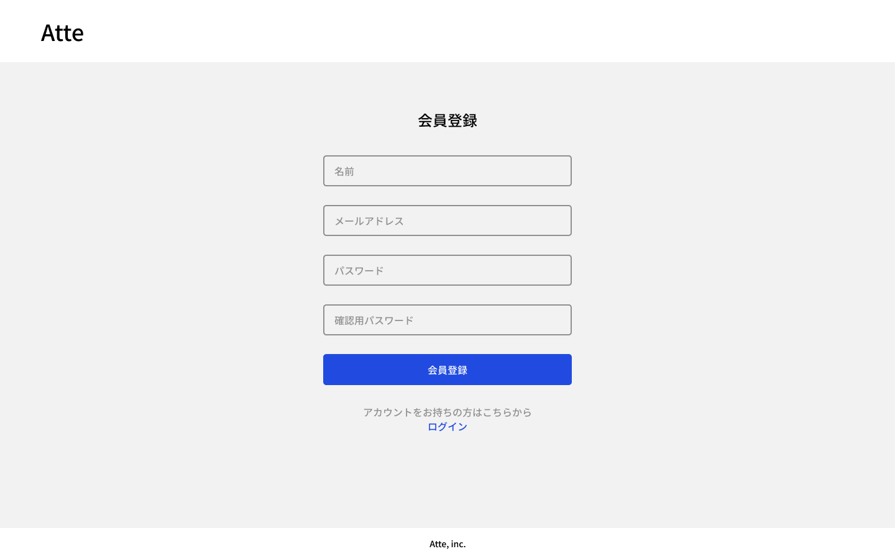
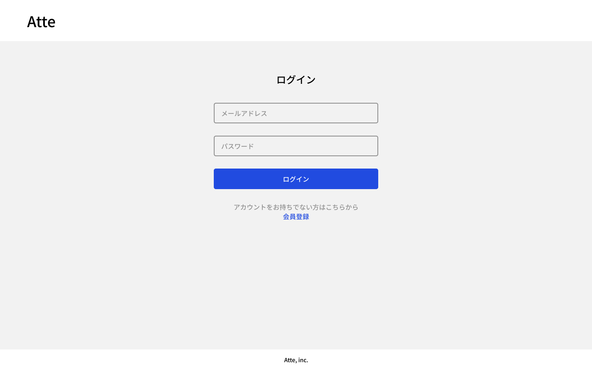
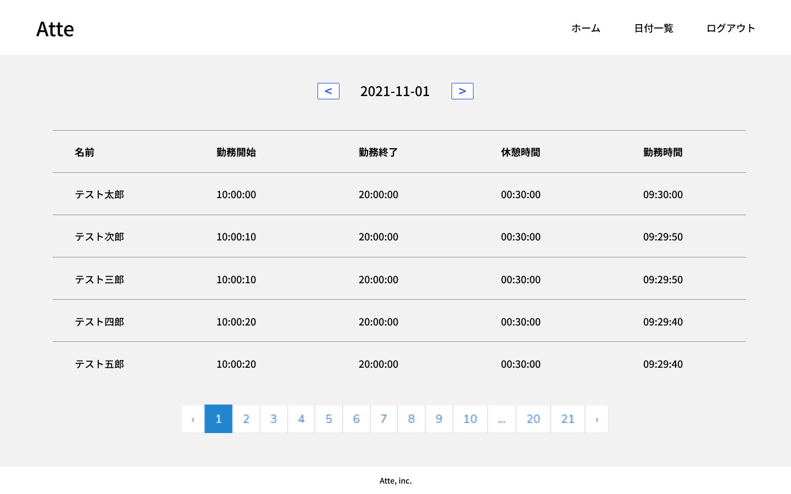
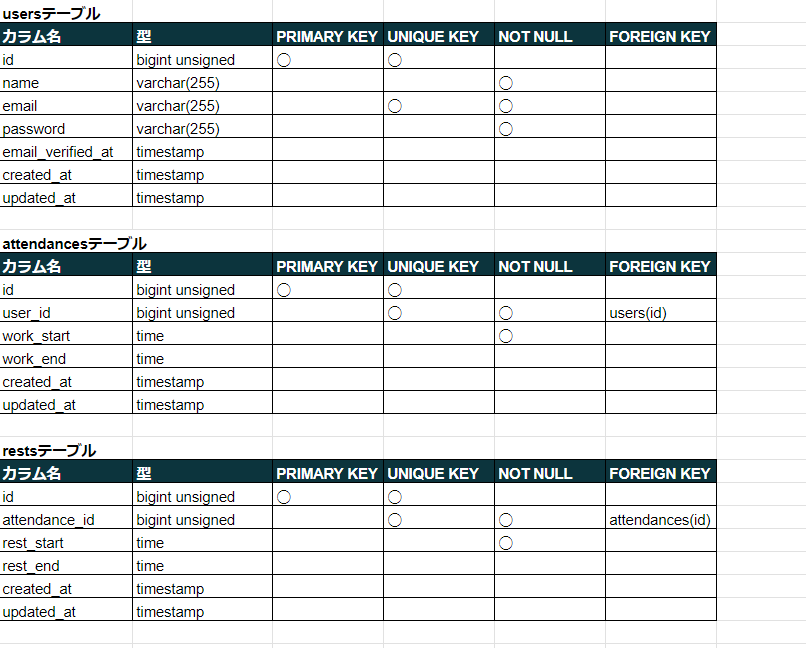
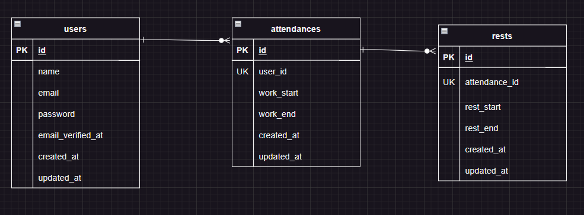

# Atte（アット）
企業の勤怠管理システム








## 作成した目的
人事評価のため

## アプリケーションURL
・開発環境:http://localhost/

・phpMyAdmin:http://localhost:8080/

会員登録のパスワードは8文字以上で登録

## 機能一覧
ログイン機能

勤務開始 勤務終了-> 日を跨いた時点で翌日の出勤操作に切り替わる

休憩開始 休憩終了-> 1日で何度も休憩が可能

日付別勤怠情報取得-> 5件ずつ取得

## 使用技術（実行環境）
・php 8.3.2

・Laravel 8.83.27

・MySQL 8.2.8

## テーブル設計


## ER図


## 環境構築
### Dockerビルド
1.`git clone https://github.com/takaokasayuko/Atte.git`

2.`cd Atte`

3.DockerDesktopアプリを立ち上げる

4.`docker-compose up -d --build`

*＊MySQLは、OSによって起動しない場合があるのでそれぞれのPCに合わせてdocker-compose.ymlファイルを編集してください。*

### Laravel環境構築
1.`docker-compose exec php bash`

2.`composer install`

3.「.env.example」ファイルを「.env」ファイルに命名変更、または新しくを作成

4..envに以下の環境変数を追加

```
DB_CONNECTION=mysql
DB_HOST=mysql
DB_PORT=3306
DB_DATABASE=laravel_db
DB_USERNAME=laravel_user
DB_PASSWORD=laravel_pass
```

4.アプリケーションキーの作成

`php artisan key:generate`


5.マイグレーションの実行

`php artisan migrate`


6.シーディングの実行

`php artisan db:seed`


