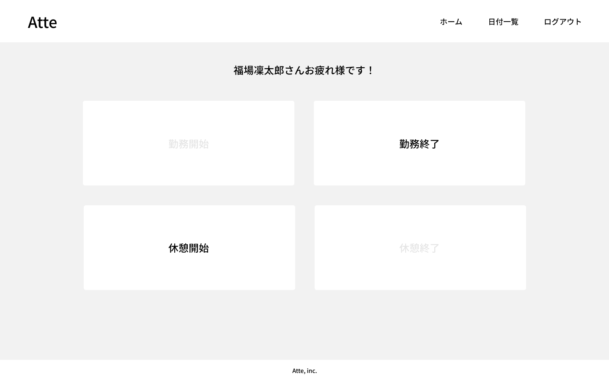

# Atte（アット）
企業の勤怠管理システム



## 作成した目的
人事評価のため

## アプリケーションURL
- 開発環境:http://localhost/
- phpMyAdmin:http://localhost:8080/

会員登録のパスワードは8文字以上で登録

## 機能一覧
1. メール認証機能
2. 勤務開始 勤務終了: 1日1回まで。日を跨いた時点で翌日の出勤操作に切り替わる
3. 休憩開始 休憩終了: 1日で何度も休憩が可能
4. 日付別勤怠情報取得 : 日付ごとに出勤したユーザーの勤務情報を5件ずつ取得。またユーザーごとに1か月の勤務情報を取得できる。

## 使用技術（実行環境）
- php 8.3.2
- Laravel 8.83.27
- MySQL 8.2.8

## テーブル設計


## ER図


## 環境構築
### Dockerビルド
1. `git clone git@github.com:takaokasayuko/Atte.git`
2. `cd Atte`
3. DockerDesktopアプリを立ち上げる
4. `docker-compose up -d --build`

*＊MySQLは、OSによって起動しない場合があるのでそれぞれのPCに合わせてdocker-compose.ymlファイルを編集してください。*

### Laravel環境構築
1. `docker-compose exec php bash`
2. `composer install`
3. 「.env.example」ファイルを「.env」ファイルに命名変更、または新しく作成`cp .env.example .env`
4. .envに以下の環境変数を追加

```text
DB_CONNECTION=mysql
DB_HOST=mysql
DB_PORT=3306
DB_DATABASE=laravel_db
DB_USERNAME=laravel_user
DB_PASSWORD=laravel_pass
```

.envファイルを編集後キャッシュクリアしてください
```text
php artisan cache:clear
php artisan view:clear
php artisan route:clear
php artisan config:cache
```

6. アプリケーションキーの作成
```bash
php artisan key:generate
```
7. マイグレーションの実行
```bash
php artisan migrate
```

Permission deniedというエラーが発生したら権限変更してください
`php sudo chmod -R 777 src/*`

8. シーディングの実行
```bash
php artisan db:seed
```

### メール環境構築
*＊GmailのSMTPサーバーを利用した方法を記載しています。*

1. Googleアカウントのセキュリティの「2段階プロセス」を有効
2. アプリパスワードの発行
3. .envファイルの環境変数に設定

```text
APP_NAME=Atte
MAIL_HOST=smtp.gmail.com
MAIL_PORT=587
MAIL_USERNAME= //メールアドレス
MAIL_PASSWORD= //アプリパスワード
MAIL_ENCRYPTION=tls
MAIL_FROM_ADDRESS= //メールアドレス
```

編集後キャッシュクリアしてください


